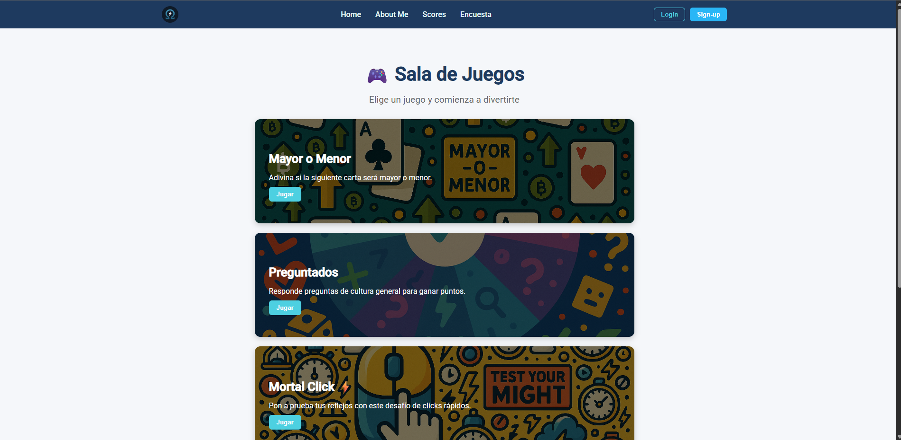
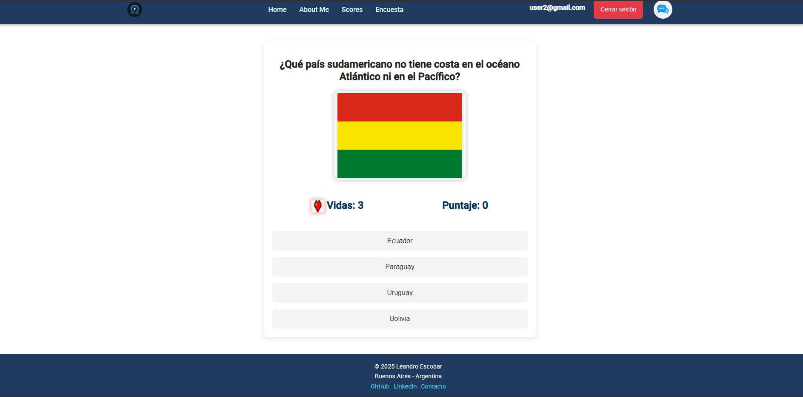
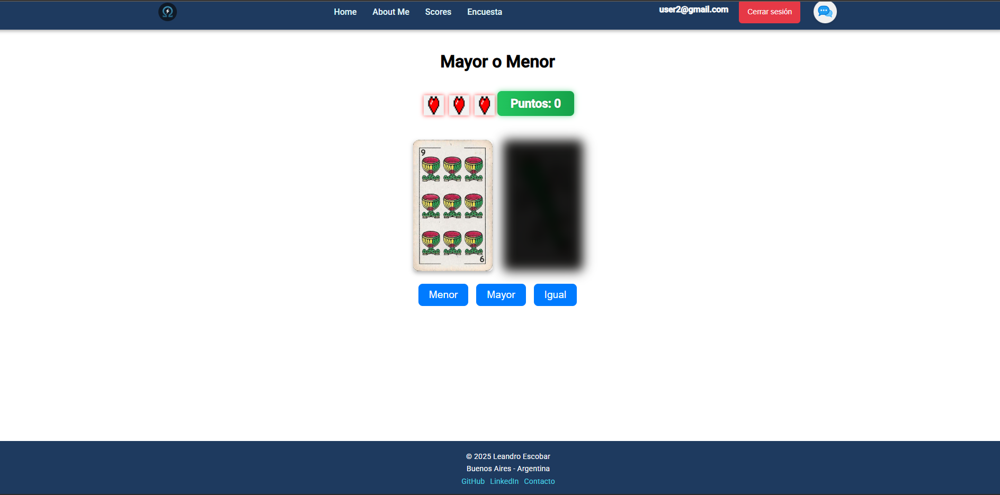
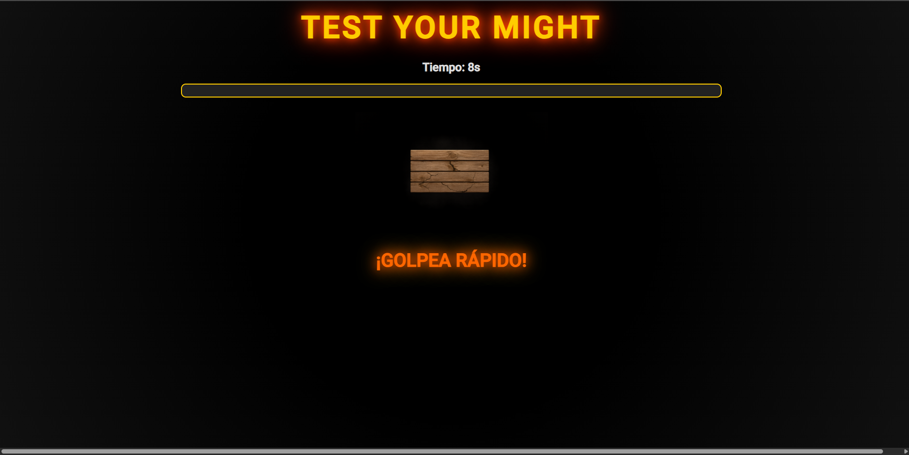
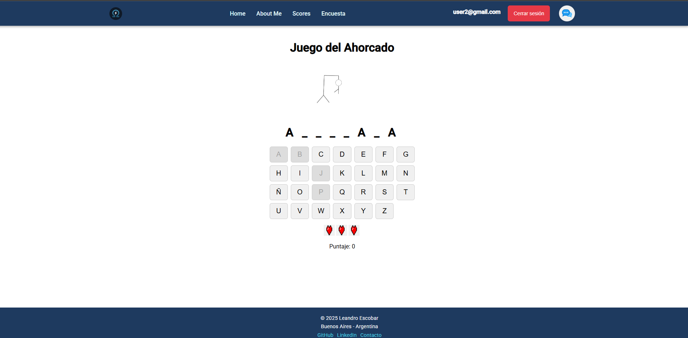
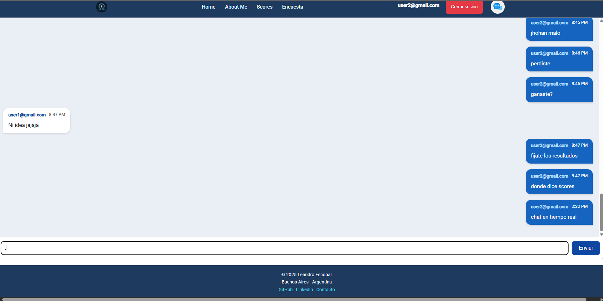
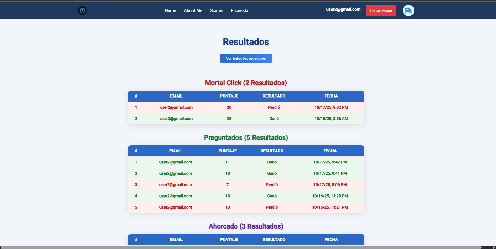
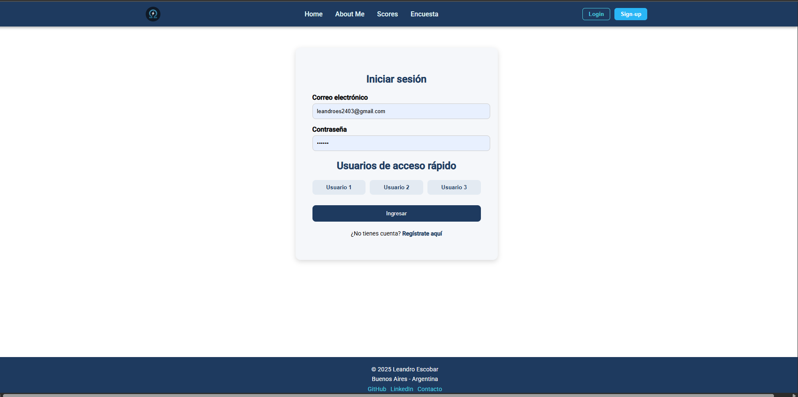
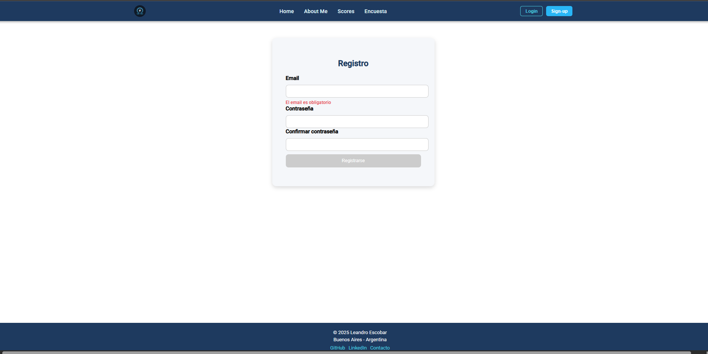

# 🎮 Sala de Juegos

> Proyecto desarrollado en **Angular** que reúne varios minijuegos interactivos con autenticación de usuarios mediante **Supabase**.  
> Creado como parte del trabajo práctico integrador de **Laboratorio IV – UTN-FRA**.

---

## 📸 Vista previa

<div align="center">
  
  <br/>
  <em>Pantalla principal del sistema con acceso a los juegos.</em>
</div>

---

## 🚀 Tecnologías utilizadas

| Tecnología | Descripción |
|-------------|-------------|
| 🅰️ **Angular** | Framework principal del proyecto |
| 🎨 **Tailwind / SCSS** | Diseño responsive y moderno |
| 🔥 **Supabase** | Backend as a Service: autenticación y base de datos |
| 🧠 **RxJS** | Programación reactiva y control de estado |
| 🛠️ **SweetAlert2** | Alertas y pop-ups personalizados |
| 🧩 **TypeScript** | Tipado estático y modularización |

---

## 🧱 Estructura del proyecto

```bash
src/
├── app/
│   ├── components/
│   │   ├── home/
│   │   ├── login/
│   │   ├── register/
│   │   ├── quien-soy/
│   │   └── juegos/
│   │       ├── ahorcado/
│   │       ├── mayor-menor/
│   │       ├── mortal-click/
│   │       └── preguntados/
│   ├── services/
│   ├── guards/
│   ├── models/
│   └── app.routes.ts
└── public/
    └── capturas/
        ├── home.png
        ├── ahorcado.png
        ├── mayor-menor.png
        ├── mortal-click.png
        ├── preguntados.png
        ├── chats.png
        └── scores.png

| Juego                 | Descripción                                                                              |
| --------------------- | ---------------------------------------------------------------------------------------- |
| 🧠 **Preguntados**    | Juego de preguntas y respuestas con imágenes dinámicas obtenidas desde la Wikipedia API. |
| 🕹️ **Mayor o Menor** | Adiviná si la siguiente carta será mayor o menor que la actual.                          |
| 🧨 **Mortal Click**   | Clicks rápidos contra el tiempo, con distintos niveles de dificultad.                    |
| 🔤 **Ahorcado**       | El clásico juego del ahorcado con palabras aleatorias.                                   |

🖼️ Galería visual de los juegos
<div align="center">
🧠 Preguntados
 
🕹️ Mayor o Menor
 
🧨 Mortal Click
 
🔤 Ahorcado
  </div>
💬 Sistema de Chat y Puntuaciones
 <div align="center">   </div>

El chat permite comunicación en tiempo real entre usuarios registrados, mientras que la sección de puntuaciones muestra los mejores resultados guardados en Supabase.

.

🔐 Autenticación

Sistema de login y registro conectado a Supabase.

Usuarios no autenticados no pueden acceder a los juegos (protegidos mediante un AuthGuard).

Formularios reactivos con validaciones y alertas visuales.

 <div align="center">   </div>